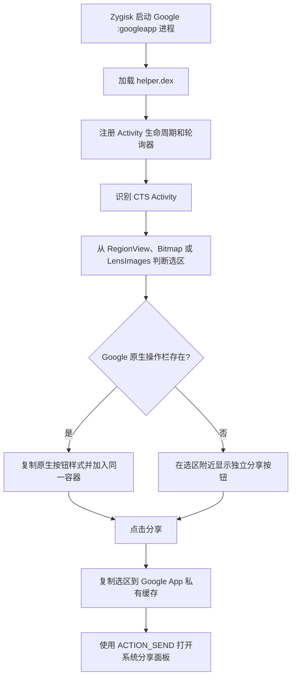

# CTS Selection Share 项目说明

## 用途

本项目是面向 arm64 Android 设备的 Zygisk 模块。它只注入 Google App 的
`com.google.android.googlequicksearchbox:googleapp` 进程，在 Circle to Search
完成选区后加入“分享”按钮，并通过 Android 系统分享面板发送选区图片。

## 架构与文件

- `jni/main.cpp`：Zygisk 入口。仅在目标进程读取 `helper.dex`，通过
  `InMemoryDexClassLoader` 加载 `dev.ctsshare.ShareBootstrap`。
- `java/dev/ctsshare/ShareBootstrap.java`：监听 CTS Activity 生命周期、识别选区、
  注入和定位按钮、准备临时图片、启动系统分享面板，并维护 CTS 返回来源任务。
- `module/`：Magisk/Zygisk 模块元数据和安装脚本。
- `build.ps1`：编译 Java/Dex 和 arm64 原生库，组装可安装 ZIP。
- `.github/workflows/build.yml`：在 GitHub Actions 的 Windows runner 上构建、检查 ZIP
  内容并上传构建产物；不进行设备端 CTS 测试。
- `jni/zygisk.hpp`：项目使用的 Zygisk API 头文件。

## 执行流程



选区矩形优先从 Google `RegionView` 的内部状态读取。由于 Google App 类名和成员会
混淆，代码会同时尝试已知方法、已知字段和类型扫描；缓存的矩形访问器失效时会重新
扫描。活动 `Region` 与有效归一化 `RectF` 同时存在即视为有效选区，不依赖“选择文本”
按钮是否出现。

## 图片与临时数据

优先分享当前选区 `Bitmap`；无法取得时回退到 Google App 私有目录中的
`files/LensImages`。分享文件写入 Google App 的 `cache/cts-share`，通过其现有
`FileProvider` URI 授权给接收应用。临时文件十分钟后删除，Google App 进程下次启动时
也会清理，不写入相册。

生命周期监听注册后，模块会主动扫描 `ActivityThread.mActivities`，恢复绑定已经处于
Resumed 状态、但因模块初始化较晚而错过 `onActivityCreated/onActivityResumed` 的 CTS
Activity。初始化后的前 30 秒内，在尚未绑定 CTS Activity 时还会每 500 ms 重试一次；
正常情况下仍以 `ActivityLifecycleCallbacks` 为主。

## CTS 返回来源

模块在新 CTS 会话开始时保存当时位于 CTS 后面的任务。系统分享面板返回时仍回到 CTS；
用户从 CTS 本身按返回键时，使用 `ActivityManager.moveTaskToFront` 返回该次 CTS 的来源
任务。切换其他应用再回到同一 CTS 不会覆盖来源；再次触发新的 CTS 会重新保存来源。

## 构建、安装与诊断

运行 `build.ps1`。构建依赖 Android SDK 36.1、Build Tools 37.0.0、JBR 21 和
Android NDK r29，输出位于 `build/`。安装 ZIP 后必须重启，使 Zygisk 在 Google App
进程创建时加载模块。

推送到 `main`、提交 pull request 或手动触发时，GitHub Actions 安装相同版本的 SDK、
Build Tools 和 NDK，运行 `build.ps1`，检查 ZIP 必需文件并上传 ZIP。CI 不发布 release。

日志标签为 `CTSShareZygisk`，可使用：

```text
adb logcat -s CTSShareZygisk
```

Debug 构建还会把 CTS 生命周期、选区识别各阶段状态、按钮容器状态和分享结果写入：

```text
/data/data/com.google.android.googlequicksearchbox/files/cts-share-debug.log
/data/data/com.google.android.googlequicksearchbox/files/cts-share-debug.log.1
```

仅在状态改变时写入，并至少间隔 250 ms；每个文件最多约 32 KB，轮转后总量最多约
64 KB。日志不包含截图、选区图片、页面文字或用户标识。

当前只构建 `arm64-v8a`。选区识别依赖 Google App 的内部 View 和混淆成员，Google App
更新后如果结构改变，可能需要重新适配。项目不保存用户截图作为诊断文件。
